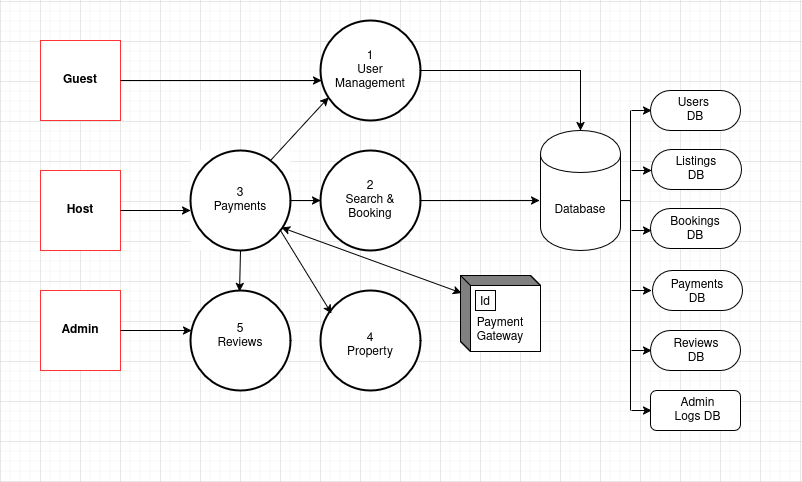

# 🏠 Airbnb Data Flow Diagram
> This is a Level 1 Data Flow Diagram (DFD) representing the core functionality of an Airbnb Clone project. Here's a breakdown of the components:

## Data flow diagram

### Entities (Red Rectangles)
- Guest: A traveler using the app to search and book accommodations.

- Host: A property owner listing their accommodations.

- Admin: Oversees users, content, and platform integrity.

### Payment Gateway: 
 - External system that processes financial transactions.

### Processes (Numbered Circles)
- User Management

  - Handles login, registration, and profile data for both guests and hosts.

- Search & Booking

  - Allows guests to search for listings and make booking requests.

- Payments

  - Handles guest payments and host payouts.

- Reviews

  - Manages guest and host reviews after bookings.

## Data Stores (Right Column)
- Users DB: Stores all user profiles (guests and hosts).

- Listings DB: Stores property listings from hosts.

- Bookings DB: Tracks reservations made by guests.

- Payments DB: Records all transactions (payments and payouts).

- Reviews DB: Stores feedback submitted by guests and hosts.

- Admin Logs DB: Keeps track of administrative actions, user reports, and moderation.

## Flows (Arrows)
- Data moves between entities, processes, and data stores.

- Each interaction represents a typical operation like searching, booking, managing accounts, or leaving reviews.

