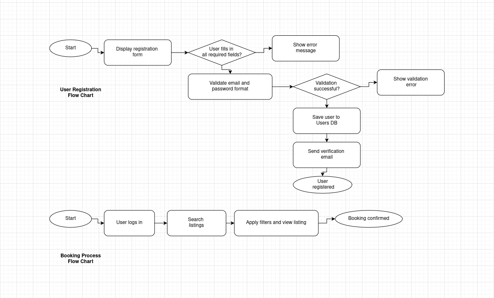

# 🏠✨ Registration and Booking Flowcharts
> These two flowcharts illustrate the core functional processes of an Airbnb clone application: User Registration and Booking. The diagrams visualize the sequential steps and decision points involved in registering a new user and booking a listing, including data validations, error handling.

## Airbnb Flow Charts
