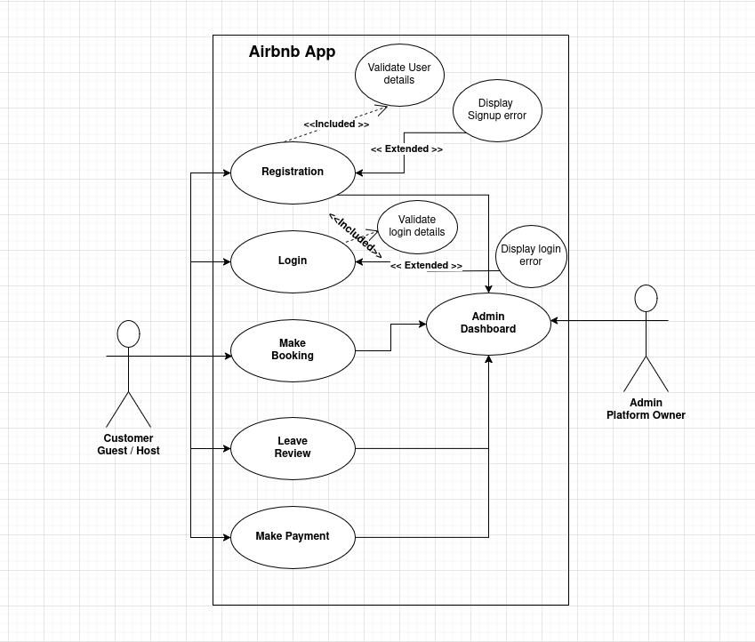

## Airbnb Use Case Diagram
> This document presents a Use Case Diagram for Airbnb, illustrating the interactions between various actors such as customers/guests, and hosts with the system. It outlines the primary functionalities offered by the platform, including booking accommodations, leaving reviews, and handling user authentication.

## Use Case Diagram

## 👤 Actors
Customer: 
- A user who registers, logs in, makes bookings, leaves reviews, and makes payments.

Host: 
- A user who can access the Admin Dashboard, typically to manage listings and bookings.

## 🔄 Use Cases and Relationships
### 1. Registration
**Actor: Customer**

 - The Registration use case includes validate user registration details.

 - It may extend to display registration error if validation fails.

### 2. Login
**Actors: Customer, Host**

- The Login use case includes validate login details.

- It may extend to display login error on failure.

### 3. Admin Dashboard
**Actors: Host**

- Allows host user to manage or view booking-related activities (though typically, deeper admin actions would be host-specific).

### 4. Make Booking
**Actor: Customer**

- Used to reserve accommodations.

### 5. Leave Review
**Actor: Customer**

- Used to submit reviews after a booking.

### 6. Make Payment
**Actor: Customer**

- Used to complete transactions for bookings.